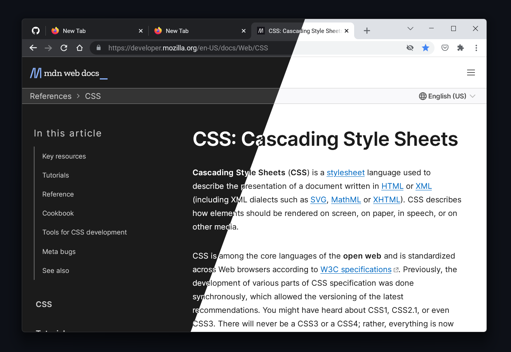

# MaterialFox UPDATED

_A Material Design-inspired userChrome.css theme for Firefox_



## Navigation

<!-- TOC -->

- [Installation](#installation)
  - [Installation script (Windows)](#installation-script)
  - [Manual installation](#manual-installation)
- [Manual Customization](#manual-customization)
- [Build & Development](#build--development)

<!-- /TOC -->

## Installation

### Prerequisites

The following properties from `about:config` must be `true`

- `toolkit.legacyUserProfileCustomizations.stylesheets`
- `svg.context-properties.content.enabled`
- `layout.css.color-mix.enabled`

### Installation script

For **Windows** you can run the following PowerShell command:

```powershell
PowerShell -ExecutionPolicy Unrestricted -Command "iwr https://raw.githubusercontent.com/edelvarden/material-fox-updated/main/install.ps1 -useb | iex"
```

### Manual installation

1. Go to the following url address `about:support`
2. Find `Profile Folder` and click `Open Folder` button
3. Download `chrome.zip` from project [releases](https://github.com/edelvarden/material-fox-updated/releases/latest) and extract into your Firefox profile directory
4. Restart Firefox to apply changes

### Screenshots

<table>
  <tr>
    <th>Light</th>
    <th>Dark</th>
  </tr>
  <tr>
    <td></img></td>
    <td></img></td>
  </tr>
 </table>

### Manual Customization

You can use some customization options.

To set preference:

1. Go to `about:config`
2. Create a custom boolean preference, just type the preference name and click the plus button, for example `userChrome.default-theme-colors`
3. Restart Firefox to apply changes

To disable, search by name and remove the preference:

1. Go to `about:config`.
2. Search by name and remove the preference.

#### Available preferences

<table>
  <tr>
    <th>Preference</th>
    <th>Description</th>
  </tr>
  <tr>
    <td><code>userChrome.compact-url-bar</code></td>
    <td>Make the URL bar more compact by reducing its height.</td>
  </tr>
  <tr>
    <td><code>userChrome.chrome-refresh-2023</code></td>
    <td>Enabling new tab bar design like in Chrome Canary version which named as "Chrome Refresh 2023".</td>
  </tr>
  <tr>
    <td><code>userChrome.default-theme-colors</code></td>
    <td>Use the default Firefox colors. This can be useful if you want use with <a href="https://addons.mozilla.org/firefox/addon/adaptive-tab-bar-colour/" _blank>Adaptive Tab Bar Color</a> or native Firefox themes</td>
  </tr>
  <tr>
    <td><code>userChrome.force-enable-animations</code></td>
    <td>Force enable control animation, because by default respects the user animation disable preference. <em>(Not required if you do not disable animation)</em></td>
  </tr>
  <tr>
    <td><code>userChrome.system-accent-colors</code></td>
    <td>Set the accent color as your system accent color</td>
  </tr>
  <tr>
    <td><code>userChrome.dracula-theme-colors</code></td>
    <td></img></td>
  </tr>
  <tr>
    <td><code>userChrome.github-theme-colors</code></td>
    <td></img></td>
  </tr>
</table>

Additionally, if you want to change some colors, you can override the default values with your own.

Follow this steps:

1. Find and rename `custom_example.css` to `custom.css` in the root folder
2. Open the css file in a text editor
3. Find the desired variable
4. Add your values, for example, set the accent color to red:

```css
:root,
html,
body {
  /* add your css below */
  --mf-accent-color: #ea4335 !important;
}
```

5. Save the file and restart Firefox to apply changes

#### Available variables

<table>
  <tr>
    <th>Variable name</th>
    <th>Description</th>
  </tr>
  <tr>
    <td><code>--mf-accent-color</code></td>
    <td>accent color</td>
  </tr>
  <tr>
    <td><code>--mf-background-color-0</code></td>
    <td>dark tones</td>
  </tr>
  <tr>
    <td><code>--mf-background-color-50</code></td>
    <td>middle tones</td>
  </tr>
  <tr>
    <td><code>--mf-background-color-100</code></td>
    <td>light tones</td>
  </tr>
  <tr>
    <td><code>--mf-text-primary</code></td>
    <td>main text color</td>
  </tr>
  <tr>
    <td><code>--mf-text-secondary</code></td>
    <td>secondary text color</td>
  </tr>
  <tr>
    <td><code>--mf-text-on-accent</code></td>
    <td>text on primary button</td>
  </tr>
  <tr>
    <td><code>--mf-menu-background-color</code></td>
    <td>menu background color</td>
  </tr>
  <tr>
    <td><code>--mf-menu-background-color-hover</code></td>
    <td>menu items background color on mouse over</td>
  </tr>
  <tr>
    <td><code>--mf-menu-border-color</code></td>
    <td>controls border color</td>
  </tr>
  <tr>
    <td><code>--mf-icon-color-primary</code></td>
    <td>navigation bar icons color</td>
  </tr>
  <tr>
    <td><code>--mf-icon-color-secondary</code></td>
    <td>URL bar icons color</td>
  </tr>
  <tr>
    <td><code>--mf-content-separator-color</code></td>
    <td>separator line between browser and content area</td>
  </tr>
  <tr>
    <td><code>--mf-selection-text-color</code></td>
    <td>text selection color</td>
  </tr>
  <tr>
    <td><code>--mf-selection-background-color</code></td>
    <td>selection background color</td>
  </tr>
</table>

## Build & Development

### Prerequisites

- [Visual Studio Code](https://code.visualstudio.com/) (development environment)
- [NodeJS](https://nodejs.org/en/download) (for npm)

### Installation

1. Open Firefox profile directory in terminal.
2. Clone this repo with the following command:

```bash
git clone https://github.com/edelvarden/material-fox-updated.git chrome
cd chrome
npm install
npx husky install
npm run dev
```

Project structure

```plaintext
[Profile Folder]
└── chrome
    ├── chrome
    ├── src
    │   ├── user-chrome
    │   ├── user-content
    │   ├── user-chrome.scss
    │   └── user-content.scss
    ├── package-lock.json
    ├── package.json
    ├── userChrome.css
    └── userContent.css
```

3. Then you can modify the files in the `src` directory, all changes will be automatically build in the `[Profile Folder]/chrome/chrome` folder.

To subsequently start the development mode, just use the following command:

```bash
npm run dev
```

## Credits

- [MaterialFox](https://github.com/muckSponge/MaterialFox) by [muckSponge](https://github.com/muckSponge)
- [edge-frfox](https://github.com/bmFtZQ/edge-frfox) by [bmFtZQ](https://github.com/bmFtZQ)
